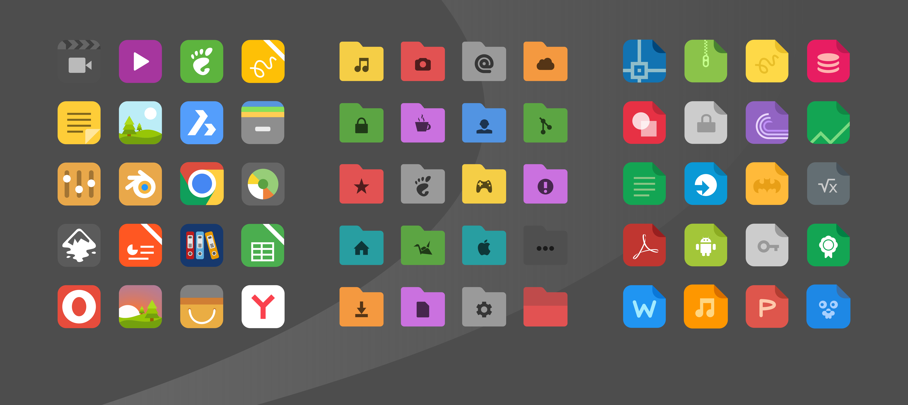

xfce-rospo-icon-theme
===============

Форк РОСПО иконок для Роса Линукс XFCE. Версия 1.3
За основу была взята замечательная тема Papirus https://store.kde.org/p/1166289/

## Изображение 

## Особенности

* Более 3000 иконок
* Различные масштабы 16х16, 24х24, 36х36, 48х48, 64х64
* Для тёмных и светлых тем

## РОСПО Дизайн-студия
https://vk.com/rospodesign

## Роса Линукс XFCE - студия сборки
https://vk.com/xfce_rospo
